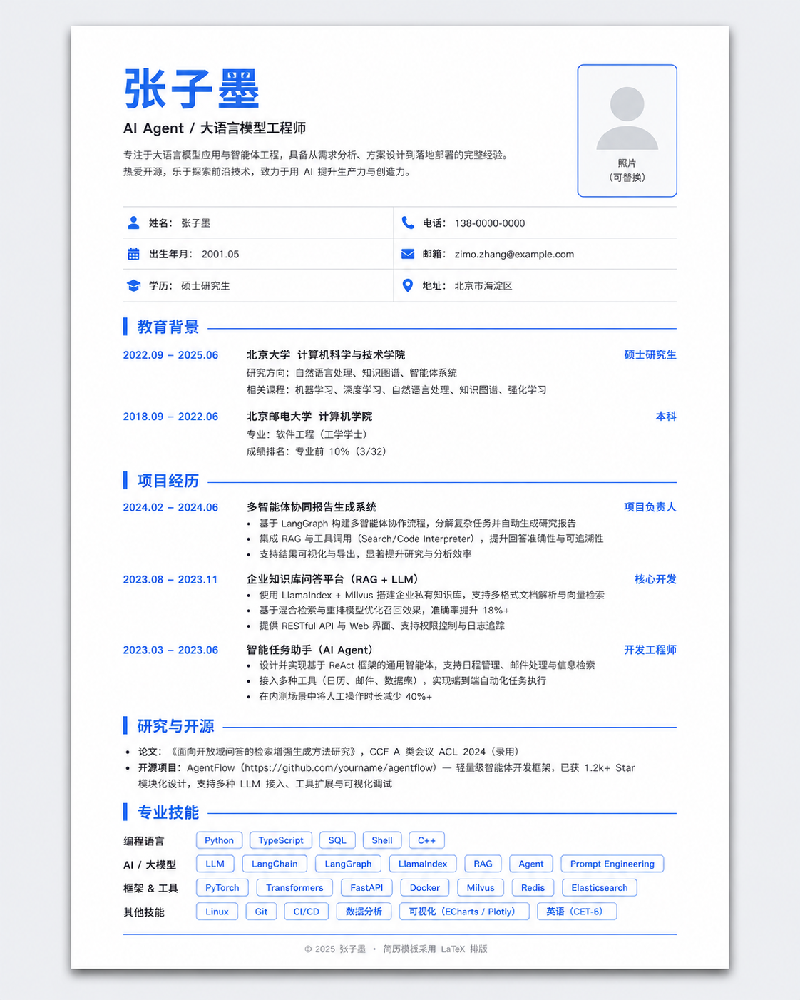
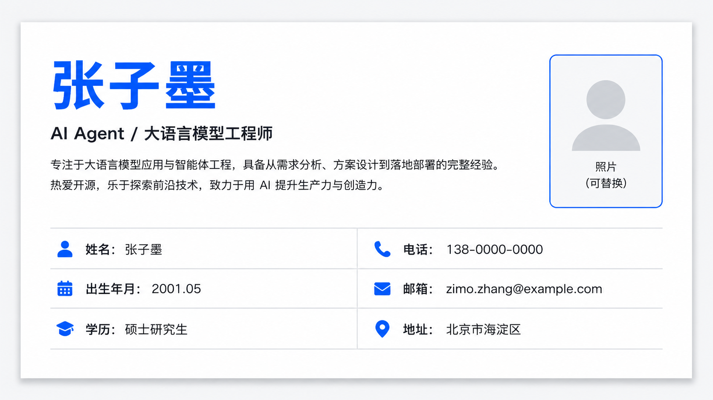
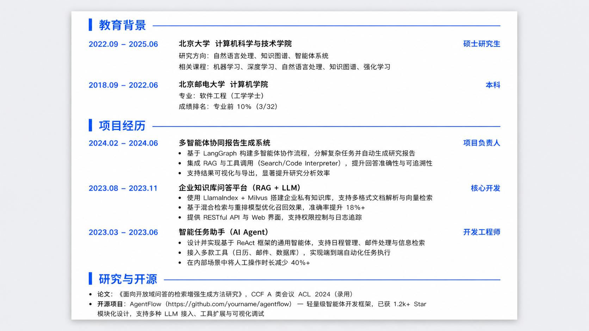
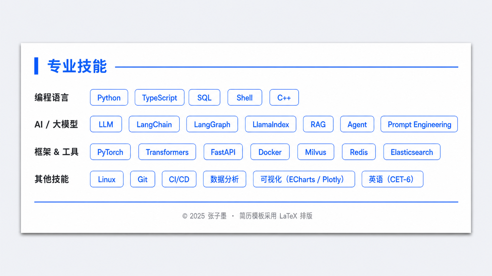
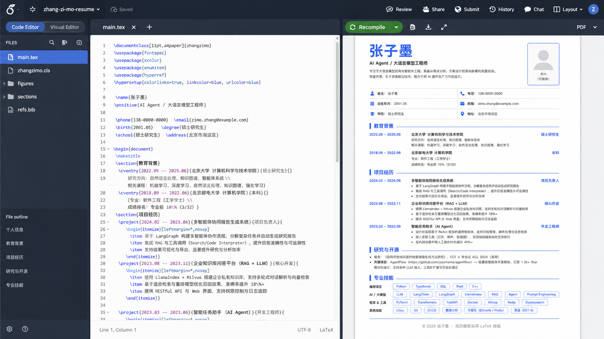

# 📘 one-page-latex-resume

<div align="center">



<br>


<br>

**一个现代、简洁、适合中文技术岗求职的一页纸 XeLaTeX 简历模板**

**A modern one-page XeLaTeX resume template for Chinese technical resumes.**

</div>

---

## 🧭 目录

- [✨ 模板特点](#-模板特点)
- [🖼️ 效果预览](#️-效果预览)
- [📂 文件结构](#-文件结构)
- [🚀 快速开始](#-快速开始)
- [🧑‍💼 修改个人信息](#-修改个人信息)
- [🖼️ 添加照片](#️-添加照片)
- [🎨 修改主题色](#-修改主题色)
- [📚 修改简历栏目](#-修改简历栏目)
- [🏷️ 修改技能标签](#️-修改技能标签)
- [🤖 ATS-friendly 说明](#-ats-friendly-说明)
- [⚙️ 常见自定义](#️-常见自定义)
- [❓ FAQ](#-faq)
- [📄 License](#-license)

---

## ✨ 模板特点

<table>
<tr>
<td width="50%">

### 🎯 面向技术岗位

适合以下方向：

- 🤖 AI / LLM / Agent 工程师
- 🧠 深度学习 / 机器学习
- 📊 数据科学 / 数学建模
- 💻 后端 / 算法 / 工程实习
- 🎓 校招 / 实习 / 社招中文简历

</td>
<td width="50%">

### 🧾 一页纸高信息密度

默认面向一页纸简历设计：

- 📄 一页纸紧凑排版
- 🔵 蓝色现代主题
- 🧩 清晰 Section 分区
- 🏷️ 技能 Tag Pill 展示
- 🖼️ 右侧照片栏位

</td>
</tr>
<tr>
<td width="50%">

### ☁️ Overleaf 友好

可以直接上传到 Overleaf 使用：

- ✅ 使用 XeLaTeX 编译
- ✅ 支持中文字体
- ✅ 支持无照片占位
- ✅ 支持 GitHub 链接
- ✅ 易于修改和维护

</td>
<td width="50%">

### 🤖 ATS-friendly 结构

模板内置：

- 📌 PDF Metadata
- 📌 英文 PDF Bookmark
- 📌 清晰的 Section 层级
- 📌 机器更容易识别的结构锚点

</td>
</tr>
</table>

---

## 🖼️ 效果预览

### 1️⃣ 整体效果

<p align="center">
  
</p>

---

### 2️⃣ Header 头部信息栏

<p align="center">
  
</p>

头部采用**三行两列信息栏**：

| 左侧 | 右侧 |
|---|---|
| 邮箱 | 电话 |
| GitHub | 现居 |
| 意向城市 | 可实习时间 |

---

### 3️⃣ Section 栏目样式

<p align="center">
  
</p>

栏目采用：

- 🔵 蓝色左侧竖条
- 📏 浅蓝细分割线
- 🧱 清晰模块边界
- 👀 适合快速扫读

---

### 4️⃣ 技能标签样式

<p align="center">
  
</p>

技能区使用 `Tag Pill` 风格，适合展示高密度技术栈。

---

### 5️⃣ Overleaf 使用示意

<p align="center">
  
</p>

---

## 📂 文件结构

```text
modern-blue-resume-template/
├── main.tex                # 简历主文件
├── photo.jpg               # 个人照片，可选
├── README.md               # 项目说明文档
├── .gitignore              # Git 忽略文件
├── LICENSE                 # 开源许可证
└── assets/                 # README 配图资源
    ├── preview-full.png
    ├── preview-header.png
    ├── preview-sections.png
    ├── preview-skills.png
    └── overleaf-demo.png
```

---

## 🚀 快速开始

## 方式一：使用 Overleaf 编译

### 1. 新建 Overleaf 项目

进入 Overleaf，新建一个空白项目。

### 2. 上传模板文件

上传以下文件：

```text
main.tex
photo.jpg   # 可选
```

### 3. 设置编译器

在 Overleaf 左上角菜单中，将编译器设置为：

```text
XeLaTeX
```

### 4. 点击编译

点击 **Recompile**，即可生成 PDF 简历。

---

## 方式二：本地编译

请先安装：

- TeX Live
- MacTeX
- MiKTeX

然后执行：

```bash
xelatex main.tex
```

如果 PDF 书签没有立即刷新，可以运行两次：

```bash
xelatex main.tex
xelatex main.tex
```

---

## 🧑‍💼 修改个人信息

个人信息位于 `main.tex` 的 Header 区域。

### 1. 修改姓名

```latex
{\fontsize{28pt}{30pt}\selectfont\bfseries\color{accent} 你的姓名}\\[6pt]
```

---

### 2. 修改岗位标题

```latex
{\Large\bfseries AI Agent / LLM 应用工程师}\\[5pt]
```

你可以改成：

```latex
{\Large\bfseries 深度学习算法实习生 / 生成式 AI 实习生}\\[5pt]
```

或：

```latex
{\Large\bfseries 数据科学实习生 / 机器学习工程师}\\[5pt]
```

---

### 3. 修改三行两列信息栏

模板默认结构如下：

```latex
{\small
\begin{tabularx}{\linewidth}{@{}>{\bfseries}l>{\raggedright\arraybackslash}X>{\bfseries}l>{\raggedright\arraybackslash}X@{}}
邮箱： & \href{mailto:your.email@example.com}{your.email@example.com}
& 电话： & (+86) 123-4567-8901 \\[2pt]

GitHub： & \href{https://github.com/your-username}{github.com/your-username}
& 现居： & 澳门 / 深圳 \\[2pt]

意向城市： & 广州 / 深圳 / 北京
& 可实习： & 立即到岗，每周 5 天 \\
\end{tabularx}
}
```

你可以替换：

- 📧 邮箱
- 📞 电话
- 🧑‍💻 GitHub
- 📍 现居城市
- 🏙️ 意向城市
- ⏰ 实习时间

---

## 🖼️ 添加照片

将照片命名为：

```text
photo.jpg
```

并放在和 `main.tex` 同一目录下。

模板已经内置判断逻辑：

```latex
\IfFileExists{photo.jpg}{
  显示照片
}{
  显示照片占位框
}
```

因此：

- ✅ 有照片：正常显示照片
- ✅ 无照片：显示占位框
- ✅ 不会因为缺少照片而编译失败

---

## 🎨 修改主题色

模板的颜色定义在这里：

```latex
\definecolor{accent}{HTML}{2563EB}
\definecolor{body}{HTML}{1F2937}
\definecolor{muted}{HTML}{6B7280}
```

| 变量 | 作用 |
|---|---|
| `accent` | 主色，用于标题、分隔线、链接、技能标签 |
| `body` | 正文颜色 |
| `muted` | 辅助灰色文字 |

---

### 改成绿色主题

```latex
\definecolor{accent}{HTML}{059669}
```

---

### 改成紫色主题

```latex
\definecolor{accent}{HTML}{7C3AED}
```

---

### 改成红色主题

```latex
\definecolor{accent}{HTML}{DC2626}
```

---

## 📚 修改简历栏目

模板默认包含：

- 🎓 教育背景
- 📂 项目经历
- 🔬 研究与开源
- 🧰 专业技能

---

### 教育背景

```latex
\cvedu
{澳门科技大学（MUST）}
{数据科学与应用数学硕士}
{2026.01 -- 2028.02 预计}

\cvmeta{核心课程：凸优化、机器学习、深度学习、数据挖掘}
```

---

### 项目经历

项目命令格式：

```latex
\cvproject
{项目名称}
{项目时间}
{技术栈}
{GitHub 链接}
```

示例：

```latex
\cvproject
{Academic RAG with Hybrid Retrieval：中英文学术混合检索}
{2025.12 -- 2026.03}
{Python · ChromaDB · BGE-M3 · BM25 · Gradio}
{https://github.com/your-username/your-repo}
```

如果暂时没有链接，最后一个参数留空：

```latex
{}
```

---

### 研究与开源

```latex
\begin{itemize}
  \item \textbf{Transformer 从零复现与训练：}基于论文复现 Transformer 架构，并完成训练稳定性分析。
  \item \textbf{开源项目：}开发并开源 LaTeX Beamer 模板。
\end{itemize}
```

---

## 🏷️ 修改技能标签

技能标签使用 `\skilltag{}`：

```latex
\skillrow{LLM / Agent}{
  \skilltag{Claude API}
  \skilltag{DeepSeek / OpenAI API}
  \skilltag{MCP}
  \skilltag{ReAct}
}
```

---

### 示例：深度学习方向

```latex
\skillrow{Deep Learning}{
  \skilltag{PyTorch}
  \skilltag{Transformer}
  \skilltag{Stable Diffusion}
  \skilltag{Knowledge Distillation}
  \skilltag{Mixed Precision}
}
```

---

### 示例：后端开发方向

```latex
\skillrow{Backend}{
  \skilltag{Python}
  \skilltag{FastAPI}
  \skilltag{PostgreSQL}
  \skilltag{Docker}
  \skilltag{Linux}
}
```

---

## 🤖 ATS-friendly 说明

本模板加入了 PDF 结构信息：

```latex
\phantomsection
\pdfbookmark[0]{Resume - Cai Dianjiao}{resume:cai-dianjiao}
```

以及各 Section 的英文书签：

```latex
\cvsection{教育背景}{Education}{education}
\cvsection{项目经历}{Projects}{projects}
\cvsection{研究与开源}{Research and Open Source}{research-open-source}
\cvsection{专业技能}{Skills}{skills}
```

这样可以做到：

- 👁️ 人眼看到的是中文简历
- 🤖 PDF 结构里包含英文栏目
- 🧾 部分 ATS / PDF 解析工具更容易识别结构

> 注意：这个模板偏视觉友好。如果投递系统非常严格，建议额外维护一份纯文本 ATS 版本。

---

## ⚙️ 常见自定义

### 调整字号

找到：

```latex
\fontsize{9.95pt}{11.35pt}\selectfont
```

可改为：

```latex
\fontsize{10.15pt}{11.75pt}\selectfont
```

如果内容超出一页，可以改小：

```latex
\fontsize{9.75pt}{11.15pt}\selectfont
```

---

### 调整页边距

找到：

```latex
\usepackage[left=0.90cm,right=0.90cm,top=0.56cm,bottom=0.56cm]{geometry}
```

如果内容太多，可以适当减小边距；如果想更宽松，可以增大边距。

---

### 调整列表间距

找到：

```latex
\setlist[itemize]{
  leftmargin=1.15em,
  itemsep=0.75pt,
  topsep=1pt,
  parsep=0pt,
  partopsep=0pt
}
```

主要修改：

```latex
itemsep=0.75pt
```

数值越大，列表越松；数值越小，越紧凑。

---

### 调整照片大小

找到：

```latex
\includegraphics[width=2.15cm,height=2.72cm,keepaspectratio]{photo.jpg}
```

可以改成：

```latex
\includegraphics[width=2.30cm,height=3.00cm,keepaspectratio]{photo.jpg}
```

---

## 🧪 推荐使用场景

| 场景 | 是否适合 |
|---|---|
| 中文技术简历 | ✅ 适合 |
| AI / LLM / Agent 岗位 | ✅ 适合 |
| 深度学习算法实习 | ✅ 适合 |
| 数据科学实习 | ✅ 适合 |
| 一页纸校招简历 | ✅ 适合 |
| 纯英文 CV | ⚠️ 需要改写 |
| 学术长 CV | ⚠️ 建议扩展为多页 |

---

## ❓ FAQ

### Q1：为什么必须用 XeLaTeX？

因为模板使用了中文字体和 `fontspec`，推荐使用 XeLaTeX 编译。

---

### Q2：没有照片会不会报错？

不会。模板会自动显示照片占位框。

---

### Q3：为什么我的中文字体显示不一样？

不同环境安装的字体不同。模板默认会优先尝试：

- Inter
- IBM Plex Sans
- Noto Sans CJK SC
- Source Han Sans SC
- Fandol

如果本地没有对应字体，会自动回退。

---

### Q4：为什么技能标签换行了？

通常是标签太多或内容太长。解决方式：

- 删除低优先级技能
- 合并相似技能
- 减小字号
- 增大页面宽度
- 缩短标签文本

---

### Q5：如何让项目标题旁边出现 GitHub 图标？

在 `\cvproject` 的第 4 个参数填入链接：

```latex
{https://github.com/your-username/your-repo}
```

如果留空：

```latex
{}
```

则不会显示图标。

---

### Q6：GitHub 仓库名可以用中文吗？

不推荐。建议使用英文仓库名，例如：

```text
modern-blue-resume-template
```

或：

```text
latex-resume-template
```

---

## 📝 TODO

后续可以扩展：

- [ ] 英文版模板
- [ ] 绿色主题版本
- [ ] 紫色主题版本
- [ ] 无照片版本
- [ ] 纯 ATS 文本版本
- [ ] GitHub Actions 自动编译 PDF
- [ ] 多页学术 CV 版本

---

## 🤝 贡献

欢迎：

- ⭐ Star 本项目
- 🍴 Fork 自定义
- 🐛 提交 Issue
- 🛠️ 提交 Pull Request

如果你基于这个模板做了自己的版本，也欢迎分享。

---

## 📄 License

本项目使用 MIT License。

你可以自由地：

- 使用
- 修改
- 分发
- 商业使用

详情请见 [LICENSE](LICENSE)。

---

<div align="center">

如果这个模板对你有帮助，欢迎点一个 ⭐

**Made with LaTeX · Designed for Chinese Technical Resumes**

</div>
