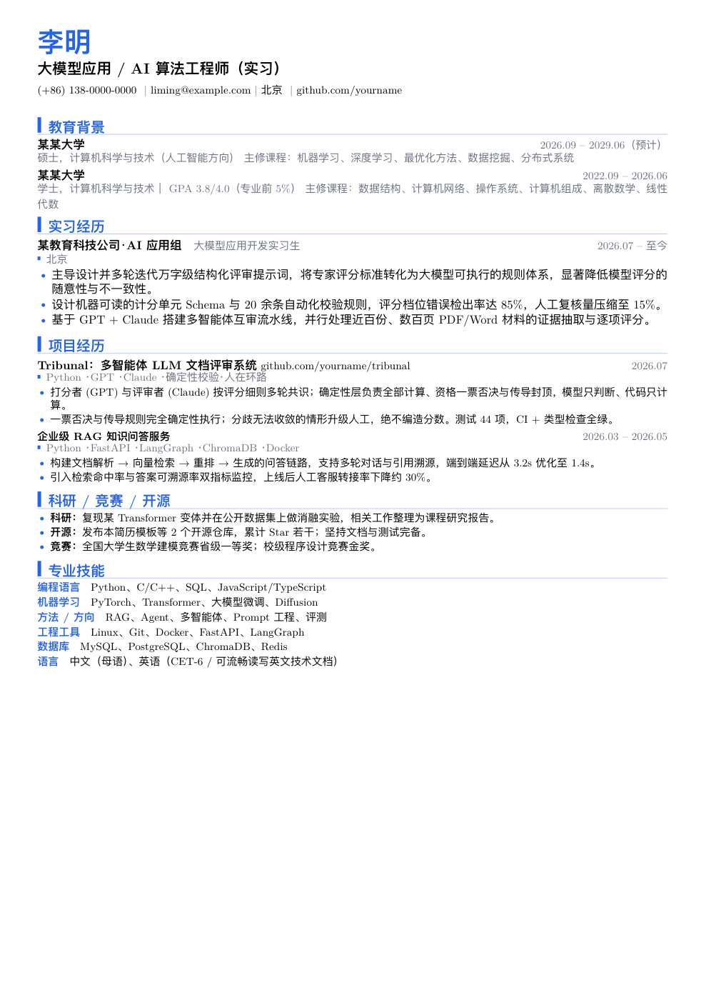
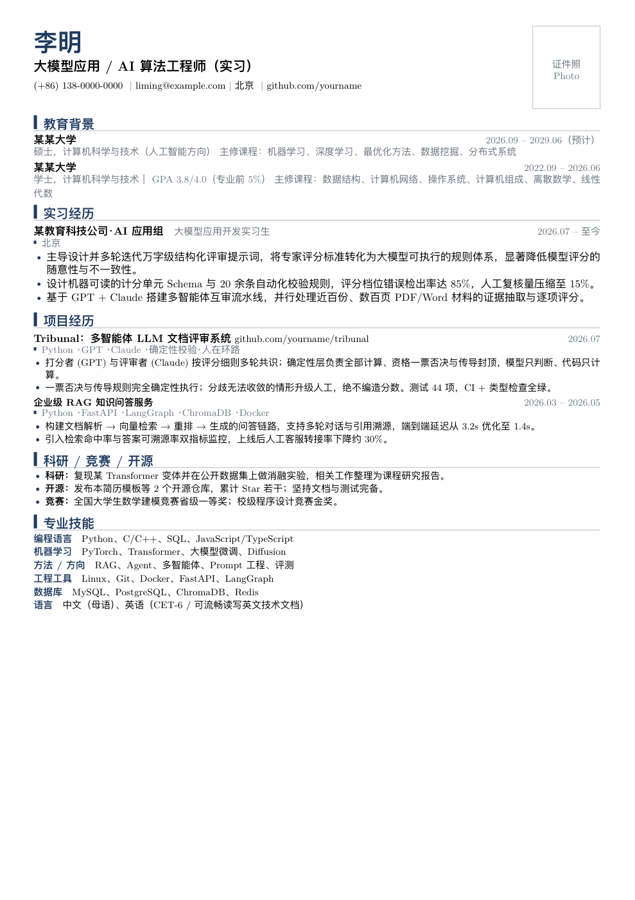
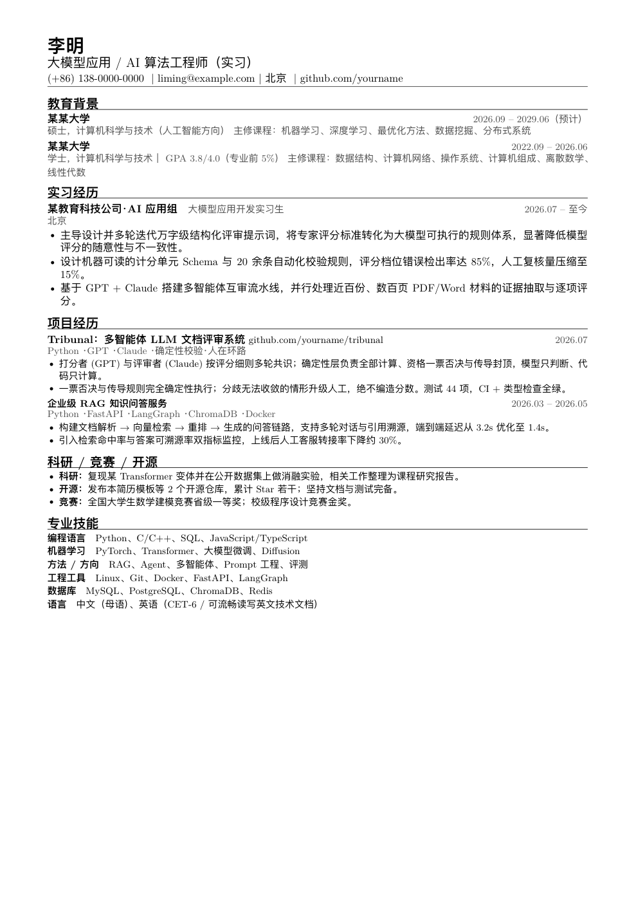

<div align="center">

# 一页纸 LaTeX 简历模板

**一套内容，三种场景**：互联网视觉版 · 央国企正式版 · 纯 ATS 解析版
中英双语 · XeLaTeX 编译 · 一键切换主题色与照片

</div>

---

## 三个版本

同一份内容数据（`content/zh.tex`），通过 `\usepackage` 选项切换排版，互不冲突：

| 版本 | 文件 | 适用 | 特点 |
|---|---|---|---|
| **互联网技术岗** | `main-internet.tex` | 算法 / AI / 开发 / 数据岗 | 蓝色、单栏、无照片、纯文本技能，兼顾基础文本解析 |
| **央国企 / 正式** | `main-soe.tex` | 央企国企、事业单位、需打印/人工审阅 | 藏青、含证件照、正式风格，黑白打印后层级依然清晰 |
| **纯 ATS 解析** | `main-ats.tex` | 走在线投递系统、需机器解析 | 单一文本流：无表格、无照片、无彩色标签，最大化文本可提取性与阅读顺序 |

英文版：`main-en.tex`（互联网视觉风格）。

<div align="center">
<table>
<tr>
<td align="center"><b>互联网版</b></td>
<td align="center"><b>央国企版</b></td>
<td align="center"><b>纯 ATS 版</b></td>
</tr>
<tr>
<td></td>
<td></td>
<td></td>
</tr>
</table>
<sub>以上预览均由当前 <code>main-*.tex</code> 直接编译生成。</sub>
</div>

---

## 正文结构

面向求职优化的顺序，实习经历为独立模块（不再塞进项目经历）：

```
教育背景  →  实习经历  →  项目经历  →  科研 / 竞赛 / 开源  →  专业技能
```

---

## 快速开始

**Overleaf**：上传整个仓库 → 打开任一 `main-*.tex` → 编译器选 **XeLaTeX** → 编译。

**本地**（需 TeX Live / MacTeX）：

```bash
xelatex main-internet.tex     # 或 main-soe / main-ats / main-en
# 或一次编译全部四个版本：
bash build.sh
```

> 建议连编两次以生成 PDF 书签。央国企版需要照片时，把 `photo.jpg` 放到仓库根目录；缺失则显示占位框。

---

## 如何修改

**只改一个文件**：`content/zh.tex`（英文改 `content/en.tex`）。三个场景版本会同步更新。

- **头部字段**：姓名、求职方向、联系方式（电话｜邮箱｜城市｜GitHub，一行文本流）。
- **PDF 关键词**：由 `\ResumeKeywords` 变量控制，默认是一组通用词——请按目标岗位修改，不要保留与方向无关的关键词。
- **央国企追加字段**：在 `content/zh.tex` 里取消注释 `\ResumeExtraLine`，可加“求职方向 / 政治面貌 / 现居地”等正式字段（默认不展示，避免公开过多个人信息）。

切换主题色 / 照片，改 `main-*.tex` 顶部的宏包选项即可：

```latex
\usepackage[blue]{resume}          % 互联网蓝，无照片
\usepackage[navy,photo]{resume}    % 央国企藏青，含照片
\usepackage[ats,mono]{resume}      % 纯文本近黑，最大 ATS 兼容
```

可用选项：`blue` / `navy` / `mono`（主题色）、`photo`（显示照片）、`ats`（纯文本流）。

---

## 关于 ATS 兼容性（重要）

本模板做了以下有利于机器解析的设计：**联系方式为单行文本流**（不用嵌套表格）、**链接显示可见文字**（不只放图标）、**技能为分类纯文本**（不用彩色标签框）、PDF 书签与可变关键词元数据。

`main-ats.tex` 进一步去掉了表格、照片和所有颜色/图标，是**目前解析最稳妥**的版本。仓库附带 `check-ats.py`，用于验证文本提取顺序：

```bash
bash build.sh && python3 check-ats.py
# 输出：姓名 → 求职方向 → 联系方式行 → 各栏目顺序正确
```

> **诚实说明**：不同 ATS 解析器差异很大。互联网视觉版可通过基本文本提取，但如果目标公司使用严格的在线申请系统，请优先投递 `main-ats.tex` 生成的 PDF。本模板定位为**文本可选中 / 基础 ATS 兼容**，而非“保证 100% ATS 通过”。

---

## 文件结构

```
resume.sty            共享样式：颜色主题、页面、所有排版命令（含场景切换逻辑）
content/zh.tex        中文内容（示例数据，改这里）
content/en.tex        英文内容
main-internet.tex     互联网技术岗版
main-soe.tex          央国企 / 正式版
main-ats.tex          纯 ATS 解析版
main-en.tex           英文版
build.sh              一键编译全部版本
check-ats.py          ATS 文本提取顺序自测
assets/               预览图（由当前 main-*.tex 编译生成）
```

---

## 许可

MIT — 自由使用、修改、商用，无需署名。示例内容为虚构数据，请替换为你自己的信息。
